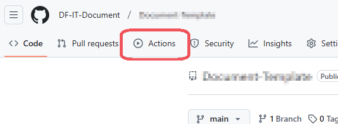
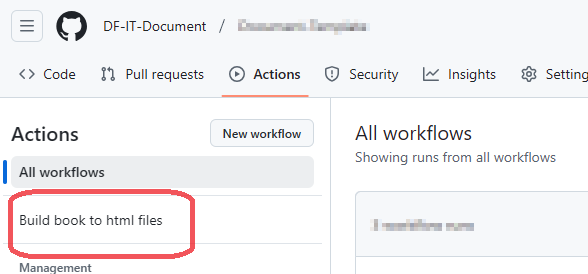
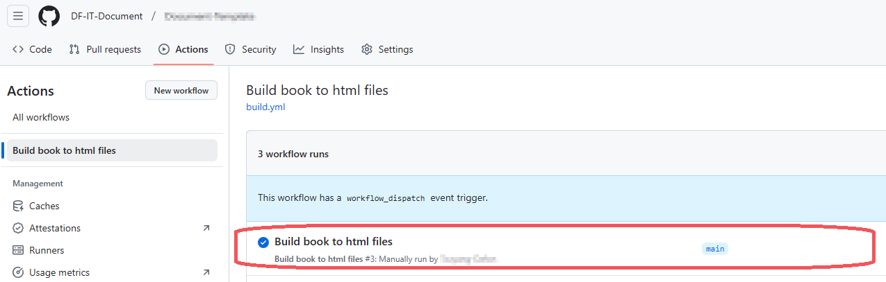
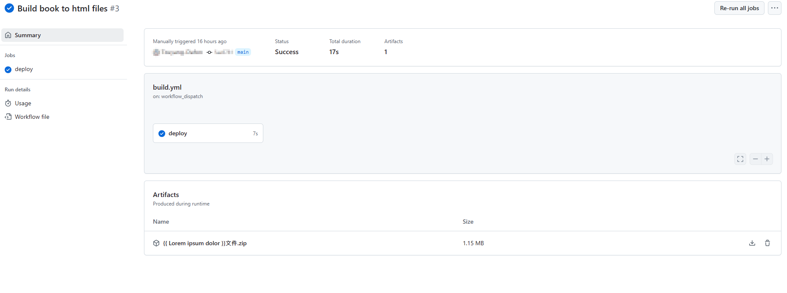

# Document-Template


本專案是{{ Lorem ipsum dolor }}。

使用 Markdown 來撰寫。

## 文件位置

文件的檔案位於 `src` 資料夾

而整份文件的目錄則位於 [`src/SUMMARY.md`](./src/SUMMARY.md)

整個專案採用 `mdbook` 的架構來撰寫，關於 mdbook 的說明可參閱[mdbook官方說明](https://rust-lang.github.io/mdBook/index.html)（[非官方的中文翻譯版](https://hellowac.github.io/mdbook-doc-zh/zh-cn/index.html)）

## 將文件轉為 HTML 網站

### 手動編譯

請先取得 mdbook（可以在[其專案](https://github.com/rust-lang/mdBook)的 [releases](https://github.com/rust-lang/mdBook/releases) 中找到已編譯好的執行檔 ）

然後到本專案的資料夾，執行 `mdbook build` 即可。

完整的指令如下：

```shell
C:\> cd {{專案資料夾}}
C:\{{專案資料夾}}> mdbook build
```

### By Github Actions

本專案已經有撰寫好 github action，每次更新都會觸發。

首先進去 **Actions** > **Build book to html files** 





選擇最新一次執行任務。




任務執行完成後，**Artifacts**會有編譯好的 HTML 網站打包成 .zip 壓縮檔。



